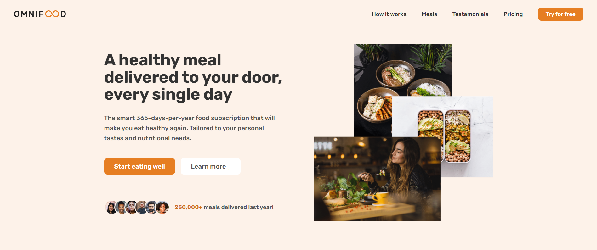

<h4>Omni Food Project From Udemy Course: Build Responsive Real-World Websites with HTML and CSS</h4>

You can find the full project in this repository

Website to project : <a href="https://udemy-omni-food.netlify.app/">Click Here</a>

